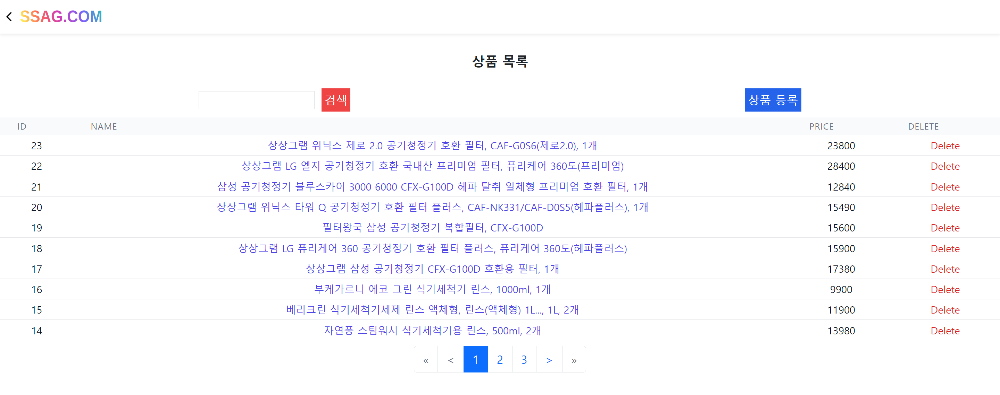
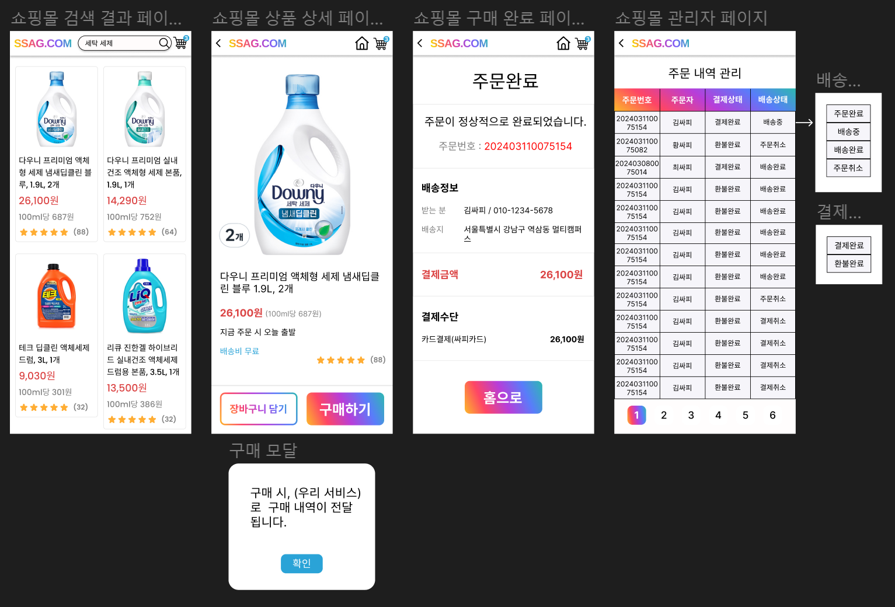
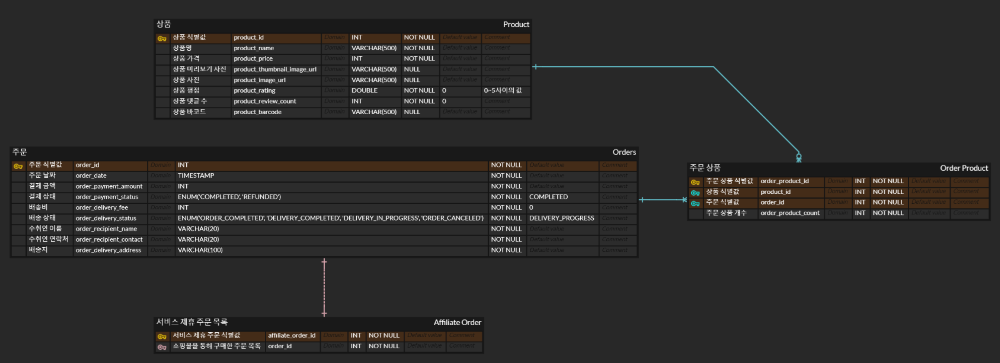
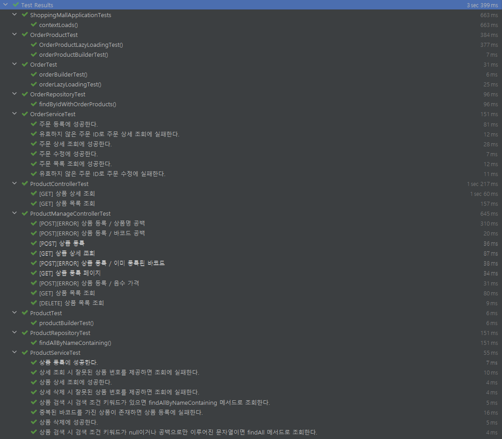

 
    
    <h2>소모아 제휴 쇼핑몰</h2>
      
    
소모아와 제휴하여 소모품을 구매할 수 있는 쇼핑몰 테스트 앱입니다.

    
소모아를 통한 주문 번호를 저장하고, 해당 주문의 배송 상태가 변화할 때 소모아 배송 상태 변경 API를 호출합니다.

 

# 기술스택

|                         SpringBoot                         |                         MariaDB                         |                         Thymeleaf                         |                         JUnit5                         |
| :--------------------------------------------------------: | :-----------------------------------------------------: | :-------------------------------------------------------: | :----------------------------------------------------: |
|  |  |  |  |

# 기능 소개

## 상품 주문

|                          일반 주문                          |                          소모아를 통한 주문                          |
| :---------------------------------------------------------: | :------------------------------------------------------------------: |
|  |  |

## 관리자 기능

|                         등록한 상품 목록                          |
| :---------------------------------------------------------------: |
|  |

|                          상품 등록                          |                          주문 관리                          |
| :---------------------------------------------------------: | :---------------------------------------------------------: |
|  |  |

# 화면설계

# ERD

# Test

